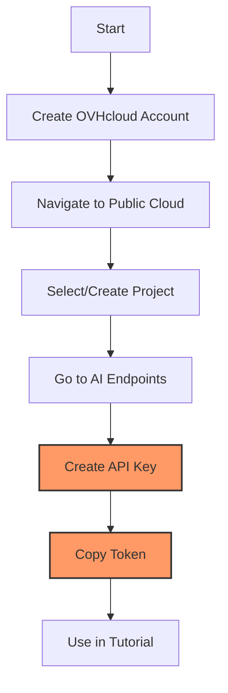

# RAG Tutorial Setup Guide

!!! info "About this guide"
    This step-by-step tutorial will walk you through building a lab-ready RAG system using OVHcloud AI Endpoints. Follow each step carefully to ensure a successful setup.

## Prerequisites

- [ ] OVHcloud account with AI Endpoints access
- [ ] Basic Python knowledge
- [ ] Linux environment (Debian 12 recommended)

## Step 1: Update System and Install Python

!!! tip "System Requirements"
    This tutorial requires Python 3.11+ and pip. The commands below will ensure your system is up-to-date.

=== "Debian/Ubuntu"
    ```bash
    # Update package list and upgrade system
    sudo apt update && sudo apt upgrade -y

    # Install Python 3.11+ and pip
    sudo apt install python3 python3-pip python3-venv curl -y

    # Verify Python version (should be 3.11+)
    python3 --version
    ```

=== "CentOS/RHEL"
    ```bash
    # Update package list and upgrade system
    sudo yum update -y
    
    # Install Python 3.11+ and pip
    sudo yum install python3 python3-pip python3-venv curl -y
    
    # Verify Python version (should be 3.11+)
    python3 --version
    ```

=== "macOS"
    ```bash
    # Install Homebrew if not already installed
    /bin/bash -c "$(curl -fsSL https://raw.githubusercontent.com/Homebrew/install/HEAD/install.sh)"
    
    # Install Python 3.11+
    brew install python@3.11
    
    # Verify Python version
    python3 --version
    ```

## Step 2: Get OVHcloud AI Endpoints Access Token

!!! warning "API Token Required"
    This tutorial requires an OVHcloud AI Endpoints access token. Without this token, you won't be able to access the embedding and LLM APIs.

### Access Token Steps

- [ ] Go to [OVHcloud AI Endpoints](https://www.ovhcloud.com/en/public-cloud/ai-endpoints/)
- [ ] Create an account or log in to your existing account
- [ ] Navigate to **Public Cloud** in the dashboard
- [ ] Create a new Public Cloud Project or select an existing one
- [ ] Navigate to **AI Endpoints** → **API keys** section
- [ ] Click on **Create a new API key** button
- [ ] Copy the generated token for use in this tutorial

!!! tip "Token Security"
    Your API token is sensitive information. Never share it publicly or commit it to version control systems. We'll use environment variables to keep it secure.



## Step 3: Create Project Directory and Virtual Environment

```bash
# Create project directory
mkdir ~/rag-ovh-test
cd ~/rag-ovh-test

# Create virtual environment
python3 -m venv venv

# Activate virtual environment
source venv/bin/activate

# Upgrade pip
pip install --upgrade pip
```

## Step 4: Install Required Dependencies

```bash
# Install ALL required dependencies for OVHcloud integration
pip install langchain langchain-community faiss-cpu requests openai python-dotenv numpy

# Verify installations
pip list | grep -E "(langchain|faiss|requests|openai|numpy)"
```

You should see output like:

```
faiss-cpu                1.11.0
langchain                0.3.25
langchain-community      0.3.24
langchain-core           0.3.61
langchain-text-splitters 0.3.8
numpy                    2.2.6
openai                   1.82.0
requests                 2.32.3
requests-toolbelt        1.0.0
```

## Step 5: Set Up Environment Variables

```bash
# Create environment file
nano .env
```

Add your actual OVHcloud token:

```
OVH_AI_ENDPOINTS_ACCESS_TOKEN=your_actual_token_here
```

## Step 6: Test OVHcloud API Connectivity

```bash
nano test_ovh_connection.py
```

```python
import os
import requests
from dotenv import load_dotenv

# Load environment variables
load_dotenv()

def test_ovh_embedding_api():
    """Test OVHcloud embedding API connectivity"""
    token = os.getenv("OVH_AI_ENDPOINTS_ACCESS_TOKEN")
    
    if not token:
        print("❌ No token found. Check your .env file.")
        return False, None
    
    # Test the three OVHcloud embedding models with correct URLs from documentation
    models_to_test = [
        {
            "name": "bge-multilingual-gemma2",
            "url": "https://bge-multilingual-gemma2.endpoints.kepler.ai.cloud.ovh.net/api/text2vec",
            "dimensions": 3584
        },
        {
            "name": "bge-base-en-v1.5", 
            "url": "https://bge-base-en-v1-5.endpoints.kepler.ai.cloud.ovh.net/api/text2vec",
            "dimensions": 768
        },
        {
            "name": "bge-m3",
            "url": "https://bge-m3.endpoints.kepler.ai.cloud.ovh.net/api/text2vec", 
            "dimensions": 1024
        }
    ]
    
    test_text = "This is a test sentence for embedding."
    
    for model in models_to_test:
        try:
            print(f"Testing {model['name']}...")
            response = requests.post(
                model["url"],
                data=test_text,
                headers={
                    "Content-Type": "text/plain",
                    "Authorization": f"Bearer {token}"
                },
                timeout=30
            )
            
            if response.status_code == 200:
                embedding = response.json()
                print(f"✅ {model['name']} works! Dimensions: {len(embedding)} (expected: {model['dimensions']})")
                print(f"First 5 values: {embedding[:5]}")
                return True, model  # Return the working model
            else:
                print(f"❌ {model['name']} failed: {response.status_code}")
                print(f"Response: {response.text}")
                
        except Exception as e:
            print(f"❌ {model['name']} connection error: {e}")
    
    return False, None

def test_ovh_llm_api():
    """Test OVHcloud LLM API connectivity"""
    from openai import OpenAI
    
    token = os.getenv("OVH_AI_ENDPOINTS_ACCESS_TOKEN")
    
    try:
        client = OpenAI(
            base_url="https://oai.endpoints.kepler.ai.cloud.ovh.net/v1",
            api_key=token
        )
        
        response = client.chat.completions.create(
            model="Meta-Llama-3_3-70B-Instruct",
            messages=[{"role": "user", "content": "Say hello in one sentence."}],
            temperature=0,
            max_tokens=50
        )
        
        print(f"✅ LLM API works! Response: {response.choices[0].message.content}")
        return True
        
    except Exception as e:
        print(f"❌ LLM API failed: {e}")
        return False

if __name__ == "__main__":
    print("Testing OVHcloud AI Endpoints connectivity...\n")
    
    embedding_ok, working_model = test_ovh_embedding_api()
    print()
    llm_ok = test_ovh_llm_api()
    
    if embedding_ok and llm_ok:
        print(f"\n🎉 All OVHcloud APIs are working!")
        print(f"✅ Working embedding model: {working_model['name']}")
        print("You can proceed with RAG testing.")
    else:
        print("\n⚠️  Some APIs failed. Check your token and try again.")
```

## Step 7: Run API Connectivity Test

```bash
# Run the connection test
python test_ovh_connection.py
```

You should see output like:

```
Testing bge-multilingual-gemma2...
✅ bge-multilingual-gemma2 works! Dimensions: 3584 (expected: 3584)
First 5 values: [-0.63427734, -1.53125, 5.6796875, -4.9648438, 0.7944336]
✅ LLM API works! Response: Hello, it's nice to meet you and I'm here to help with any questions or topics you'd like to discuss.
```

**Note**: The negative values in embeddings are normal - they represent coordinates in high-dimensional space and can be positive or negative.

## Step 8: Create Full RAG Test Script

```bash
nano test_rag_ovh.py
```

```python
import os
import requests
from langchain.schema import Document
from langchain_community.vectorstores import FAISS  # Updated import
from langchain.embeddings.base import Embeddings
from langchain.llms.base import LLM
from langchain.chains import RetrievalQA
from typing import List
from dotenv import load_dotenv

# Load environment variables
load_dotenv()

class OVHEmbeddings(Embeddings):
    """OVHcloud embeddings wrapper for LangChain."""
    
    def __init__(self, model_name="bge-multilingual-gemma2"):
        self.token = os.getenv("OVH_AI_ENDPOINTS_ACCESS_TOKEN")
        
        # Model configurations
        self.models = {
            "bge-multilingual-gemma2": {
                "url": "https://bge-multilingual-gemma2.endpoints.kepler.ai.cloud.ovh.net/api/text2vec",
                "dimensions": 3584
            },
            "bge-base-en-v1.5": {
                "url": "https://bge-base-en-v1-5.endpoints.kepler.ai.cloud.ovh.net/api/text2vec",
                "dimensions": 768
            },
            "bge-m3": {
                "url": "https://bge-m3.endpoints.kepler.ai.cloud.ovh.net/api/text2vec",
                "dimensions": 1024
            }
        }
        
        if model_name not in self.models:
            raise ValueError(f"Model {model_name} not supported. Available: {list(self.models.keys())}")
        
        self.model_name = model_name
        self.url = self.models[model_name]["url"]
    
    def embed_documents(self, texts: List[str]) -> List[List[float]]:
        embeddings = []
        for text in texts:
            response = requests.post(
                self.url,
                data=text,
                headers={
                    "Content-Type": "text/plain",
                    "Authorization": f"Bearer {self.token}"
                }
            )
            if response.status_code == 200:
                embeddings.append(response.json())
            else:
                raise Exception(f"Embedding failed for model {self.model_name}: {response.status_code} - {response.text}")
        return embeddings
    
    def embed_query(self, text: str) -> List[float]:
        return self.embed_documents([text])[0]

class OVHLLM(LLM):
    """OVHcloud LLM wrapper for LangChain."""
    
    def __init__(self):
        super().__init__()
        token = os.getenv("OVH_AI_ENDPOINTS_ACCESS_TOKEN")
        if not token:
            raise ValueError("OVH_AI_ENDPOINTS_ACCESS_TOKEN environment variable is required")
        
        try:
            from openai import OpenAI
            self._client = OpenAI(
                base_url="https://oai.endpoints.kepler.ai.cloud.ovh.net/v1",
                api_key=token
            )
        except Exception as e:
            raise Exception(f"Failed to setup OpenAI client: {e}")
    
    def _call(self, prompt: str, stop=None) -> str:
        try:
            response = self._client.chat.completions.create(
                model="Meta-Llama-3_3-70B-Instruct",
                messages=[{"role": "user", "content": prompt}],
                temperature=0,
                max_tokens=1024
            )
            return response.choices[0].message.content
        except Exception as e:
            raise Exception(f"LLM call failed: {e}")
    
    @property
    def _llm_type(self) -> str:
        return "ovh_llm"

def setup_rag_system():
    """Set up the complete RAG system with LangChain."""
    
    print("🔧 Setting up RAG system...")
    
    # Create knowledge base
    chunks = [
        Document(
            page_content="Export crashes occur with files over 4GB on Mac due to memory limits. This affects ProRes format specifically.",
            metadata={"source": "troubleshooting_guide", "chunk_id": 1}
        ),
        Document(
            page_content="Solution for 4GB+ export crashes: Enable compression in export settings, then switch from ProRes to H.264 codec. This reduces memory usage by 60%.",
            metadata={"source": "troubleshooting_guide", "chunk_id": 2}
        ),
        Document(
            page_content="Windows users experiencing export issues should update graphics drivers to latest version. Download from manufacturer website.",
            metadata={"source": "troubleshooting_guide", "chunk_id": 3}
        )
    ]
    
    # Build vector store with similarity threshold
    print("📊 Creating embeddings...")
    # Use bge-multilingual-gemma2 since it worked in your connection test
    embeddings = OVHEmbeddings(model_name="bge-multilingual-gemma2")
    vectorstore = FAISS.from_documents(chunks, embeddings)
    
    # Use regular similarity search instead of score threshold (due to embedding scoring issues)
    retriever = vectorstore.as_retriever(
        search_type="similarity",
        search_kwargs={"k": 3}  # Get top 3 results
    )
    
    # Create RAG chain
    print("🤖 Setting up LLM...")
    llm = OVHLLM()
    rag_chain = RetrievalQA.from_chain_type(
        llm=llm,
        chain_type="stuff",
        retriever=retriever,
        return_source_documents=True
    )
    
    print("✅ RAG system ready!")
    return rag_chain

def main():
    try:
        rag_system = setup_rag_system()
        
        # Test queries
        test_queries = [
            "My video export keeps crashing",
            "How do I fix export crashes on Mac?",
            "Why does my coffee taste bitter?"  # No-match scenario
        ]
        
        for question in test_queries:
            print(f"\n{'='*60}")
            print(f"❓ Question: {question}")
            
            # Use the new invoke method instead of deprecated __call__
            result = rag_system.invoke({"query": question})
            print(f"💬 Answer: {result['result']}")
            
            if result.get('source_documents'):
                sources = [f"Chunk {doc.metadata['chunk_id']}" 
                          for doc in result['source_documents']]
                print(f"📚 Sources: {', '.join(sources)}")
            else:
                print("📚 Sources: No matching sources found")
                
    except Exception as e:
        print(f"❌ Error: {e}")
        print("Make sure your OVH_AI_ENDPOINTS_ACCESS_TOKEN is correct in .env file")

if __name__ == "__main__":
    main()
```

## Step 9: Run Full RAG Test

```bash
# Run the complete RAG system test
python test_rag_ovh.py
```

Expected output:

```
🔧 Setting up RAG system...
📊 Creating embeddings...
🤖 Setting up LLM...
✅ RAG system ready!

============================================================
❓ Question: My video export keeps crashing
💬 Answer: This sounds like the known 4GB file issue on Mac systems...
📚 Sources: Chunk 1, Chunk 2
```

## Step 10: Performance Testing

Create and run a comprehensive performance test that compares all three embedding models:

```bash
nano performance_test.py
```

```python
import time
from test_rag_ovh import OVHEmbeddings, OVHLLM, Document
from langchain_community.vectorstores import FAISS
from langchain.chains import RetrievalQA

def test_model_performance(model_name):
    """Test performance for a specific embedding model"""
    print(f"\n🧪 Testing {model_name}...")
    
    # Create knowledge base
    chunks = [
        Document(
            page_content="Export crashes occur with files over 4GB on Mac due to memory limits. This affects ProRes format specifically.",
            metadata={"source": "troubleshooting_guide", "chunk_id": 1}
        ),
        Document(
            page_content="Solution for 4GB+ export crashes: Enable compression in export settings, then switch from ProRes to H.264 codec. This reduces memory usage by 60%.",
            metadata={"source": "troubleshooting_guide", "chunk_id": 2}
        ),
        Document(
            page_content="Windows users experiencing export issues should update graphics drivers to latest version. Download from manufacturer website.",
            metadata={"source": "troubleshooting_guide", "chunk_id": 3}
        )
    ]
    
    # Setup timing
    start_time = time.time()
    
    # Create embeddings and vector store
    embeddings = OVHEmbeddings(model_name=model_name)
    vectorstore = FAISS.from_documents(chunks, embeddings)
    retriever = vectorstore.as_retriever(search_type="similarity", search_kwargs={"k": 3})
    
    # Create RAG chain
    llm = OVHLLM()
    rag_chain = RetrievalQA.from_chain_type(
        llm=llm,
        chain_type="stuff",
        retriever=retriever,
        return_source_documents=True
    )
    
    setup_time = time.time() - start_time
    print(f"⏱️  Setup time: {setup_time:.2f} seconds")
    
    # Test queries
    test_query = "My video export keeps crashing"
    
    start_time = time.time()
    result = rag_chain.invoke({"query": test_query})
    query_time = time.time() - start_time
    
    print(f"⏱️  Query time: {query_time:.2f} seconds")
    print(f"💬 Answer: {result['result']}")
    
    return setup_time, query_time

def test_performance():
    """Test performance across all embedding models"""
    print("🚀 Starting comprehensive performance test...")
    
    models = [
        "bge-base-en-v1.5",      # 768 dimensions
        "bge-m3",                # 1024 dimensions  
        "bge-multilingual-gemma2" # 3584 dimensions
    ]
    
    results = {}
    
    for model in models:
        try:
            setup_time, query_time = test_model_performance(model)
            results[model] = {"setup": setup_time, "query": query_time}
        except Exception as e:
            print(f"❌ {model} failed: {e}")
            results[model] = {"setup": None, "query": None}
    
    # Summary
    print(f"\n{'='*60}")
    print("📊 PERFORMANCE SUMMARY")
    print(f"{'='*60}")
    print(f"{'Model':<25} {'Dimensions':<12} {'Setup':<10} {'Query':<10}")
    print("-" * 60)
    
    model_dims = {"bge-base-en-v1.5": 768, "bge-m3": 1024, "bge-multilingual-gemma2": 3584}
    
    for model, times in results.items():
        dims = model_dims[model]
        setup = f"{times['setup']:.2f}s" if times['setup'] else "Failed"
        query = f"{times['query']:.2f}s" if times['query'] else "Failed"
        print(f"{model:<25} {dims:<12} {setup:<10} {query:<10}")
    
    print(f"\n💡 Performance Insights:")
    print("   • Higher dimensions = better accuracy, slower performance")
    print("   • Lower dimensions = faster performance, potentially less accuracy")
    print("   • Choose based on your speed vs accuracy requirements")

if __name__ == "__main__":
    test_performance()
```

**Run the performance test:**

```bash
python performance_test.py
```

Expected output:

```
🚀 Starting comprehensive performance test...

🧪 Testing bge-base-en-v1.5...
⏱️  Setup time: 0.85 seconds
⏱️  Query time: 1.45 seconds
💬 Answer: [LLM response here]

📊 PERFORMANCE SUMMARY
============================================================
Model                     Dimensions   Setup      Query     
------------------------------------------------------------
bge-base-en-v1.5         768          0.85s      1.45s     
bge-m3                   1024         0.95s      1.60s     
bge-multilingual-gemma2  3584         1.16s      1.99s
```

## Step 11: Test OVHcloud Documentation Examples

Create and run a test that matches OVHcloud's official documentation:

```bash
nano test_ovh_docs_example.py
```

```python
import os
import requests
import numpy as np
from dotenv import load_dotenv

load_dotenv()

def test_ovh_docs_examples():
    """Test the exact examples from OVHcloud documentation"""
    
    # Test data from OVHcloud docs
    text = [
        "Paris is the capital of France",
        "Paris is the capital of France", 
        "Berlin is the capital of Germany",
        "This endpoint converts input sentence into a vector embeddings"
    ]
    
    headers = {
        "Content-Type": "text/plain",
        "Authorization": f"Bearer {os.getenv('OVH_AI_ENDPOINTS_ACCESS_TOKEN')}",
    }
    
    # Test all three models from documentation
    models = [
        ("bge-multilingual-gemma2", "https://bge-multilingual-gemma2.endpoints.kepler.ai.cloud.ovh.net/api/text2vec"),
        ("bge-m3", "https://bge-m3.endpoints.kepler.ai.cloud.ovh.net/api/text2vec"),
        ("bge-base-en-v1.5", "https://bge-base-en-v1-5.endpoints.kepler.ai.cloud.ovh.net/api/text2vec")
    ]
    
    # Cosine similarity function from docs
    def cosine_similarity(vec_source, vec_compare):
        return np.dot(vec_source, vec_compare)
    
    for model_name, url in models:
        print(f"\n🧪 Testing {model_name}...")
        print(f"URL: {url}")
        
        response_data = []
        sentence_similarity = {}
        
        for s in range(len(text)):
            # Generate embeddings vector
            response = requests.post(url, data=text[s], headers=headers)
            if response.status_code == 200:
                response_data.append(response.json())
                if s > 0:
                    # Calculate sentence similarity
                    similarity = cosine_similarity(response_data[0], response_data[s])
                    sentence_similarity[f"Similarity with sentence n°{s}"] = "{:.3f}".format(similarity)
            else:
                print(f"❌ Error: {response.status_code}")
                print(f"Response: {response.text}")
                break
        
        if response_data:
            print(f"✅ {model_name} working!")
            print(f"📊 Embedding dimensions: {len(response_data[0])}")
            print(f"🔍 Similarities: {sentence_similarity}")
            return model_name, url  # Return first working model
        else:
            print(f"❌ {model_name} failed")
    
    return None, None

if __name__ == "__main__":
    print("Testing OVHcloud documentation examples...")
    working_model, working_url = test_ovh_docs_examples()
    
    if working_model:
        print(f"\n🎉 Success! Use {working_model} for RAG testing.")
        print(f"Working URL: {working_url}")
    else:
        print("\n❌ All models failed. Check your token.")
```

**Run this test:**

```bash
python test_ovh_docs_example.py
```

You should see output showing successful embedding generation and similarity calculations.

## Step 12: Experiment and Customize

Now that everything is working, try customizing the scripts to deepen your understanding:

### A. Test Different Knowledge Bases

Edit `test_rag_ovh.py` and replace the chunks with your own content:

```bash
nano test_rag_ovh.py
```

Find the `chunks = [...]` section and replace with different knowledge:

```python
chunks = [
    Document(
        page_content="OVHcloud is a European cloud provider that keeps your data sovereign - meaning your data stays where you put it, not scattered across unknown servers in foreign countries. Perfect for companies who like to know where their bits and bytes are vacationing!",
        metadata={"source": "ovh_facts", "chunk_id": 1}
    ),
    Document(
        page_content="OVHcloud offers predictable pricing with no surprise bills at month-end. Unlike some cloud providers who charge you for breathing near their servers, OVHcloud tells you upfront what you'll pay. It's like having a honest mechanic, but for cloud computing!",
        metadata={"source": "ovh_facts", "chunk_id": 2}
    ),
    Document(
        page_content="OVHcloud uses water cooling in their standard server design, making their data centers more efficient than air-cooled alternatives. They're literally keeping it cool while keeping costs down - talk about a refreshing approach to cloud infrastructure!",
        metadata={"source": "ovh_facts", "chunk_id": 3}
    ),
    Document(
        page_content="OVHcloud's Go Global initiative spans 4 continents with data centers worldwide, yet maintains local presence and support. They're globally distributed but locally rooted - like a multinational company that still remembers your birthday!",
        metadata={"source": "ovh_facts", "chunk_id": 4}
    )
]
```

### B. Try Different Questions

Modify the `test_queries` list to ask questions relevant to your new knowledge base:

```python
test_queries = [
    "What makes OVHcloud different for data sovereignty?",
    "How does OVHcloud keep pricing predictable?",
    "Tell me about OVHcloud's cooling technology",
    "How do I bake a perfect soufflé?"  # Irrelevant question to test boundaries
]
```

### C. Test Different Models

Create a quick model comparison script:

```bash
nano model_comparison.py
```

```python
from test_rag_ovh import OVHEmbeddings
import requests
import os
from dotenv import load_dotenv

load_dotenv()

def compare_embeddings():
    """Compare how different models embed the same text"""
    test_text = "OVHcloud provides data sovereignty with predictable pricing and innovative water cooling technology."
    
    models = ["bge-base-en-v1.5", "bge-m3", "bge-multilingual-gemma2"]
    
    for model in models:
        try:
            embeddings = OVHEmbeddings(model_name=model)
            result = embeddings.embed_query(test_text)
            print(f"{model}: {len(result)} dimensions, first 3 values: {result[:3]}")
        except Exception as e:
            print(f"{model}: Failed - {e}")

if __name__ == "__main__":
    compare_embeddings()
```

```bash
python model_comparison.py
```

### D. Experiment with Similarity Thresholds

Create a similarity experiment:

```bash
nano similarity_experiment.py
```

```python
from langchain_community.vectorstores import FAISS
from langchain.schema import Document
from test_rag_ovh import OVHEmbeddings

def test_similarity_thresholds():
    """Experiment with different similarity approaches"""
    
    # Create test documents about cloud providers
    docs = [
        Document(page_content="OVHcloud ensures data sovereignty by keeping your data in specific geographic regions with transparent policies"),
        Document(page_content="AWS offers global cloud services with pay-as-you-use pricing across multiple availability zones"), 
        Document(page_content="Cats are domestic animals that make popular pets and enjoy playing with yarn"),
        Document(page_content="Dogs are loyal companion animals known for their intelligence and trainability")
    ]
    
    embeddings = OVHEmbeddings(model_name="bge-base-en-v1.5")
    vectorstore = FAISS.from_documents(docs, embeddings)
    
    query = "Tell me about cloud data sovereignty"
    
    # Test different k values
    for k in [1, 2, 3, 4]:
        results = vectorstore.similarity_search(query, k=k)
        print(f"\nTop {k} results for '{query}':")
        for i, doc in enumerate(results):
            print(f"  {i+1}. {doc.page_content}")

if __name__ == "__main__":
    test_similarity_thresholds()
```

```bash
python similarity_experiment.py
```

### E. Create Your Own RAG Application

Try building a simple RAG app for a cooking assistant:

```bash
nano my_rag_app.py
```

```python
from test_rag_ovh import OVHEmbeddings, OVHLLM, Document
from langchain_community.vectorstores import FAISS
from langchain.chains import RetrievalQA

def create_ovhcloud_rag():
    """Create a RAG system for OVHcloud information"""
    
    # OVHcloud knowledge base with fun facts
    ovhcloud_knowledge = [
        Document(
            page_content="OVHcloud pioneered using water cooling in standard server designs, making data centers 30% more energy efficient than traditional air cooling. They're literally keeping it cool while saving the planet - one server at a time!",
            metadata={"source": "ovh_tech", "chunk_id": 1}
        ),
        Document(
            page_content="OVHcloud's pay-as-you-go model means you only pay for what you actually use, with per-second billing on many services.
