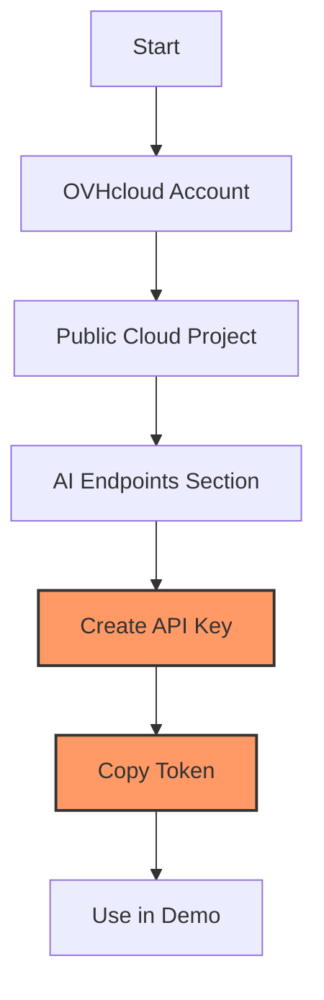

# VLM Tutorial - Car Verification Setup Guide

!!! info "About this guide"
    This step-by-step tutorial will walk you through testing the AI car verification demo using OVHcloud's Vision Language Models. Follow each step carefully to explore AI vision capabilities.

## Prerequisites

- [ ] OVHcloud account with AI Endpoints access
- [ ] Basic Python knowledge
- [ ] Car photos for testing (at least 3 different images)
- [ ] Linux/macOS/Windows environment

## Step 1: System Setup and Python Installation

!!! tip "System Requirements"
    This demo requires Python 3.11+ and pip. Choose your operating system below.

=== "Debian/Ubuntu"
    ```bash
    # Update system
    sudo apt update && sudo apt upgrade -y

    # Install Python 3.11+ and dependencies
    sudo apt install python3 python3-pip python3-venv curl -y

    # Verify Python version
    python3 --version
    ```

=== "CentOS/RHEL"
    ```bash
    # Update system
    sudo yum update -y

    # Install Python and dependencies
    sudo yum install python3 python3-pip python3-venv curl -y

    # Verify installation
    python3 --version
    ```

=== "macOS"
    ```bash
    # Install Homebrew if needed
    /bin/bash -c "$(curl -fsSL https://raw.githubusercontent.com/Homebrew/install/HEAD/install.sh)"

    # Install Python 3.11+
    brew install python@3.11

    # Verify installation
    python3 --version
    ```

=== "Windows"
    ```powershell
    # Download Python from python.org and install
    # Or use Windows Package Manager
    winget install Python.Python.3.11

    # Verify installation
    python --version
    ```

## Step 2: Get OVHcloud AI Endpoints Access Token

!!! warning "Vision Model Access Required"
    This demo requires access to OVHcloud's Qwen2.5-VL-72B-Instruct model. You'll need an AI Endpoints access token.

### Token Acquisition Steps

- [ ] Go to [OVHcloud AI Endpoints](https://www.ovhcloud.com/en/public-cloud/ai-endpoints/)
- [ ] Create account or sign in
- [ ] Navigate to **Public Cloud** dashboard
- [ ] Create or select existing Public Cloud Project
- [ ] Go to **AI Endpoints** → **API keys**
- [ ] Click **Create a new API key**
- [ ] Copy the generated token

!!! tip "Token Storage"
    Keep your token secure - we'll store it in environment variables for safety.



## Step 3: Create Demo Environment

```bash
# Create demo directory
mkdir ~/car-verification-demo
cd ~/car-verification-demo

# Create Python virtual environment
python3 -m venv venv

# Activate virtual environment
source venv/bin/activate  # Linux/macOS
# OR for Windows: venv\Scripts\activate

# Upgrade pip
pip install --upgrade pip
```

## Step 4: Download Requirements File

Download the requirements file from the repository:

```bash
# Download requirements.txt
curl -o requirements.txt https://raw.githubusercontent.com/cougz/ovhcloud-workbooks/main/public-cloud/ai-endpoints/vlm-tutorial-car-damage-verfication/requirements.txt

# Install all dependencies
pip install -r requirements.txt

# Verify installations
pip list | grep -E "(chainlit|pillow|requests)"
```

You should see output showing the installed packages and their versions.

## Step 5: Configure Environment Variables

```bash
# Create environment configuration file
nano .env
```

Add your OVHcloud token:

```bash
# OVHcloud AI Endpoints Configuration
OVH_AI_ENDPOINTS_ACCESS_TOKEN=your_actual_token_here

# AI Model Endpoint
QWEN_URL=https://qwen-2-5-vl-72b-instruct.endpoints.kepler.ai.cloud.ovh.net/api/openai_compat/v1/chat/completions
```

## Step 6: Download Tutorial Files

Download all the required Python files from the repository:

=== "Option 1: Download Individual Files"
    Download each file individually from GitHub:
    
    ```bash
    # Download all required files
    curl -o requirements.txt https://raw.githubusercontent.com/cougz/ovhcloud-workbooks/main/public-cloud/ai-endpoints/vlm-tutorial-car-damage-verfication/requirements.txt
    curl -o test_vision_connection.py https://raw.githubusercontent.com/cougz/ovhcloud-workbooks/main/public-cloud/ai-endpoints/vlm-tutorial-car-damage-verfication/test_vision_connection.py
    curl -o verification_demo.py https://raw.githubusercontent.com/cougz/ovhcloud-workbooks/main/public-cloud/ai-endpoints/vlm-tutorial-car-damage-verfication/verification_demo.py
    curl -o verification_app.py https://raw.githubusercontent.com/cougz/ovhcloud-workbooks/main/public-cloud/ai-endpoints/vlm-tutorial-car-damage-verfication/verification_app.py
    curl -o chainlit.md https://raw.githubusercontent.com/cougz/ovhcloud-workbooks/main/public-cloud/ai-endpoints/vlm-tutorial-car-damage-verfication/chainlit.md
    ```

=== "Option 2: Clone Repository"
    Clone the entire repository and copy the files:
    
    ```bash
    # Clone the repository
    git clone https://github.com/cougz/ovhcloud-workbooks.git
    
    # Copy VLM tutorial files to your demo directory
    cp ovhcloud-workbooks/public-cloud/ai-endpoints/vlm-tutorial-car-damage-verfication/requirements.txt .
    cp ovhcloud-workbooks/public-cloud/ai-endpoints/vlm-tutorial-car-damage-verfication/*.py .
    cp ovhcloud-workbooks/public-cloud/ai-endpoints/vlm-tutorial-car-damage-verfication/chainlit.md .
    
    # Clean up
    rm -rf ovhcloud-workbooks
    ```

=== "Option 3: Manual Download"
    Visit the GitHub repository and download files manually:
    
    1. Go to [VLM Tutorial Files](https://github.com/cougz/ovhcloud-workbooks/tree/main/public-cloud/ai-endpoints/vlm-tutorial-car-damage-verfication)
    2. Click on each file and download:
       - `requirements.txt`
       - `test_vision_connection.py`
       - `verification_demo.py` 
       - `verification_app.py`
       - `chainlit.md`
    3. Save them to your `~/car-verification-demo` directory

!!! tip "File Contents"
    You can also view the complete source code for each file in the [repository](https://github.com/cougz/ovhcloud-workbooks/tree/main/public-cloud/ai-endpoints/vlm-tutorial-car-damage-verfication) to understand how the VLM verification system works.

## Step 7: Test OVHcloud Vision API Connectivity

```bash
# Test the vision API connection
python test_vision_connection.py
```

Expected output:

```
Testing OVHcloud Vision API connectivity...

🔍 Testing OVHcloud Vision API...
✅ Vision API works!
🤖 AI Response: I can see a simple drawing of a red car with black wheels on a light blue background. There's text that says "TEST CAR" at the top of the image.

🎉 Vision API is working! Ready for demo testing.
```

## Step 8: Launch the Interactive Demo

Now that you have all the files, you can run the car verification demo:

```bash
# First, test the API connection
python test_vision_connection.py

# If successful, run the interactive demo
chainlit run verification_app.py --host 0.0.0.0 --port 8000
```

You should see:

```
2025-06-03 09:39:15 - Loaded .env file
2025-06-03 09:39:16 - Your app is available at http://localhost:8000
```

!!! note "Network Access"
    The demo is accessible from any device on your network via `http://YOUR_SERVER_IP:8000`

## Step 9: Demo Testing Scenarios

### Scenario A: Truth Test

**Test honest claims to see AI verification:**

1. **Access the demo:** Open http://localhost:8000 in your browser
2. **Enter true details:**
   - Manufacturer: Toyota
   - Model: Camry
   - Color: White
   - Damage: Scratch on front bumper
3. **Upload matching photos:** 3 photos of an actual white Toyota Camry with visible front damage
4. **Observe results:** AI should confirm all claims match

### Scenario B: Deception Detection Test

**Test if AI catches false claims:**

1. **Enter false details:**
   - Manufacturer: BMW
   - Model: 4 Series
   - Color: Black
   - Damage: No damage
2. **Upload different car:** Photos of a white Honda Civic with visible dents
3. **Watch AI detect lies:** Should catch all false claims

### Scenario C: Partial Truth Test

**Test mixed true/false claims:**

1. **Enter mixed details:**
   - Manufacturer: Honda (correct)
   - Model: Civic (correct)
   - Color: Blue (correct)
   - Damage: No damage (false - car has rear damage)
2. **Upload photos:** Blue Honda Civic with hidden rear damage
3. **See AI spot omission:** Should verify car details but catch undisclosed damage

## Expected Demo Results

✅ **Successful Demo Run:**

- API connectivity test passes
- Web interface loads at localhost:8000
- AI processes images in 30-60 seconds
- Verification reports show detailed analysis
- AI catches discrepancies between claims and photos

✅ **Learning Outcomes:**

- Understanding of AI vision capabilities
- Experience with prompt engineering
- Knowledge of API integration patterns
- Realistic expectations for AI accuracy

## Troubleshooting

### Common Issues

**Connection Errors:**
```bash
# Test your token
python test_vision_connection.py
```

**Image Upload Problems:**
- Check file formats (PNG, JPG, JPEG, WebP supported)
- Reduce image sizes if upload fails
- Ensure at least 3 photos for verification

**Slow Performance:**
- Reduce image resolution
- Check network connection
- Wait for processing (30-60 seconds normal)

**Token Errors:**
- Verify OVHcloud AI Endpoints token in `.env`
- Check token permissions and expiration
- Regenerate token if needed

## Clean Up

```bash
# Deactivate virtual environment when done
deactivate

# Optional: Save your experiments
mkdir results
# Save any generated verification reports

# Optional: Remove demo directory
# rm -rf ~/car-verification-demo
```

## Quick Start Commands Summary

```bash
# Complete demo setup (copy-paste friendly)
mkdir ~/car-verification-demo && cd ~/car-verification-demo && \
python3 -m venv venv && source venv/bin/activate

# Download all tutorial files
curl -o requirements.txt https://raw.githubusercontent.com/cougz/ovhcloud-workbooks/main/public-cloud/ai-endpoints/vlm-tutorial-car-damage-verfication/requirements.txt
curl -o test_vision_connection.py https://raw.githubusercontent.com/cougz/ovhcloud-workbooks/main/public-cloud/ai-endpoints/vlm-tutorial-car-damage-verfication/test_vision_connection.py
curl -o verification_demo.py https://raw.githubusercontent.com/cougz/ovhcloud-workbooks/main/public-cloud/ai-endpoints/vlm-tutorial-car-damage-verfication/verification_demo.py
curl -o verification_app.py https://raw.githubusercontent.com/cougz/ovhcloud-workbooks/main/public-cloud/ai-endpoints/vlm-tutorial-car-damage-verfication/verification_app.py
curl -o chainlit.md https://raw.githubusercontent.com/cougz/ovhcloud-workbooks/main/public-cloud/ai-endpoints/vlm-tutorial-car-damage-verfication/chainlit.md

# Install dependencies
pip install -r requirements.txt

# Create .env with your token
echo "OVH_AI_ENDPOINTS_ACCESS_TOKEN=your_token_here" > .env
echo "QWEN_URL=https://qwen-2-5-vl-72b-instruct.endpoints.kepler.ai.cloud.ovh.net/api/openai_compat/v1/chat/completions" >> .env

# Test connection
python test_vision_connection.py

# Run the demo
chainlit run verification_app.py --host 0.0.0.0 --port 8000
```

This demo successfully demonstrates OVHcloud's Vision Language Model capabilities for practical verification tasks while maintaining clear educational boundaries.
