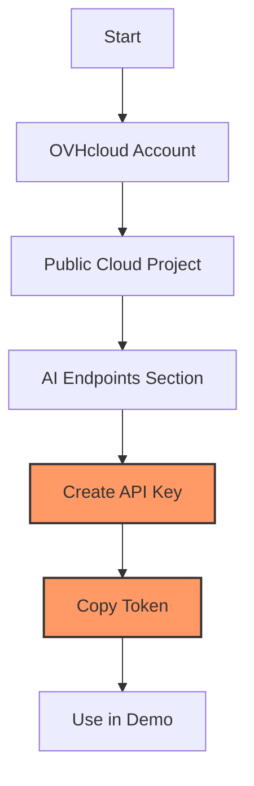

# VLM Tutorial - Car Verification Setup Guide

!!! info "About this guide"
    This step-by-step tutorial will walk you through testing the AI car verification demo using OVHcloud's Vision Language Models. Follow each step carefully to explore AI vision capabilities.

## Prerequisites

- [ ] OVHcloud account with AI Endpoints access
- [ ] Basic Python knowledge
- [ ] Car photos for testing (at least 3 different images)
- [ ] Linux/macOS/Windows environment

## Step 1: System Setup and Python Installation

!!! tip "System Requirements"
    This demo requires Python 3.11+ and pip. Choose your operating system below.

=== "Debian/Ubuntu"
    ```bash
    # Update system
    sudo apt update && sudo apt upgrade -y

    # Install Python 3.11+ and dependencies
    sudo apt install python3 python3-pip python3-venv curl -y

    # Verify Python version
    python3 --version
    ```

=== "CentOS/RHEL"
    ```bash
    # Update system
    sudo yum update -y

    # Install Python and dependencies
    sudo yum install python3 python3-pip python3-venv curl -y

    # Verify installation
    python3 --version
    ```

=== "macOS"
    ```bash
    # Install Homebrew if needed
    /bin/bash -c "$(curl -fsSL https://raw.githubusercontent.com/Homebrew/install/HEAD/install.sh)"

    # Install Python 3.11+
    brew install python@3.11

    # Verify installation
    python3 --version
    ```

=== "Windows"
    ```powershell
    # Download Python from python.org and install
    # Or use Windows Package Manager
    winget install Python.Python.3.11

    # Verify installation
    python --version
    ```

## Step 2: Get OVHcloud AI Endpoints Access Token

!!! warning "Vision Model Access Required"
    This demo requires access to OVHcloud's Qwen2.5-VL-72B-Instruct model. You'll need an AI Endpoints access token.

### Token Acquisition Steps

- [ ] Go to [OVHcloud AI Endpoints](https://www.ovhcloud.com/en/public-cloud/ai-endpoints/)
- [ ] Create account or sign in
- [ ] Navigate to **Public Cloud** dashboard
- [ ] Create or select existing Public Cloud Project
- [ ] Go to **AI Endpoints** → **API keys**
- [ ] Click **Create a new API key**
- [ ] Copy the generated token

!!! tip "Token Storage"
    Keep your token secure - we'll store it in environment variables for safety.



## Step 3: Create Demo Environment

```bash
# Create demo directory
mkdir ~/car-verification-demo
cd ~/car-verification-demo

# Create Python virtual environment
python3 -m venv venv

# Activate virtual environment
source venv/bin/activate  # Linux/macOS
# OR for Windows: venv\Scripts\activate

# Upgrade pip
pip install --upgrade pip
```

## Step 4: Install Demo Dependencies

```bash
# Install required packages for the demo
pip install chainlit==1.0.504 \
           pillow==10.1.0 \
           requests==2.31.0 \
           python-dotenv==1.0.0 \
           aiofiles==23.2.1

# Verify installations
pip list | grep -E "(chainlit|pillow|requests)"
```

You should see output like:

```
aiofiles                 23.2.1
chainlit                 1.0.504
pillow                   10.1.0
python-dotenv            1.0.0
requests                 2.31.0
```

## Step 5: Configure Environment Variables

```bash
# Create environment configuration file
nano .env
```

Add your OVHcloud token:

```bash
# OVHcloud AI Endpoints Configuration
OVH_AI_ENDPOINTS_ACCESS_TOKEN=your_actual_token_here

# AI Model Endpoint
QWEN_URL=https://qwen2-5-vl-72b-instruct.endpoints.kepler.ai.cloud.ovh.net/v1/chat/completions
```

## Step 6: Test OVHcloud Vision API Connectivity

```bash
nano test_vision_connection.py
```

```python
import os
import base64
import requests
from PIL import Image, ImageDraw
import io
from dotenv import load_dotenv

load_dotenv()

def create_test_image():
    """Create a simple test image for API testing"""
    # Create a 200x150 test image
    img = Image.new('RGB', (200, 150), color='lightblue')
    draw = ImageDraw.Draw(img)
    
    # Draw a simple car shape
    draw.rectangle([50, 60, 150, 110], fill='red', outline='black', width=2)
    draw.ellipse([60, 100, 80, 120], fill='black')  # Left wheel
    draw.ellipse([120, 100, 140, 120], fill='black')  # Right wheel
    draw.text((10, 10), "TEST CAR", fill='black')
    
    # Convert to base64
    buffer = io.BytesIO()
    img.save(buffer, format='PNG')
    buffer.seek(0)
    
    return base64.b64encode(buffer.getvalue()).decode('utf-8')

def test_vision_api():
    """Test OVHcloud Vision API connectivity"""
    token = os.getenv("OVH_AI_ENDPOINTS_ACCESS_TOKEN")
    url = os.getenv("QWEN_URL")
    model = "Qwen2.5-VL-72B-Instruct"  # Fixed model for demo
    
    if not token:
        print("❌ No token found. Check your .env file.")
        return False
    
    # Create test image
    test_image_b64 = create_test_image()
    
    headers = {
        "Authorization": f"Bearer {token}",
        "Content-Type": "application/json"
    }
    
    payload = {
        "model": model,
        "messages": [
            {
                "role": "user",
                "content": [
                    {
                        "type": "text",
                        "text": "What do you see in this image? Describe it briefly."
                    },
                    {
                        "type": "image_url",
                        "image_url": {
                            "url": f"data:image/png;base64,{test_image_b64}"
                        }
                    }
                ]
            }
        ],
        "max_tokens": 100,
        "temperature": 0.1
    }
    
    try:
        print("🔍 Testing OVHcloud Vision API...")
        response = requests.post(url, json=payload, headers=headers, timeout=30)
        
        if response.status_code == 200:
            result = response.json()
            ai_response = result['choices'][0]['message']['content']
            print(f"✅ Vision API works!")
            print(f"🤖 AI Response: {ai_response}")
            return True
        else:
            print(f"❌ API failed: {response.status_code}")
            print(f"Response: {response.text}")
            return False
            
    except Exception as e:
        print(f"❌ Connection error: {e}")
        return False

if __name__ == "__main__":
    print("Testing OVHcloud Vision API connectivity...\n")
    
    if test_vision_api():
        print("\n🎉 Vision API is working! Ready for demo testing.")
    else:
        print("\n⚠️ Vision API test failed. Check your token and try again.")
```

## Step 7: Run Vision API Connectivity Test

```bash
# Test the vision API connection
python test_vision_connection.py
```

Expected output:

```
Testing OVHcloud Vision API connectivity...

🔍 Testing OVHcloud Vision API...
✅ Vision API works!
🤖 AI Response: I can see a simple drawing of a red car with black wheels on a light blue background. There's text that says "TEST CAR" at the top of the image.

🎉 Vision API is working! Ready for demo testing.
```

## Step 8: Create the Verification Demo Engine

```bash
nano verification_demo.py
```

Copy the complete verification_demo.py code from the tutorial files.

## Step 9: Create the Interactive Demo Interface

```bash
nano verification_app.py
```

Copy the complete verification_app.py code from the tutorial files.

Now create the Chainlit welcome file:

```bash
nano chainlit.md
```

```markdown
# 🕵️ Car Verification Challenge

Welcome to the ultimate AI fact-checking experiment! 

**The Challenge:** Tell me about your car, then upload photos. Let's see if the AI can catch you if you're not being truthful!

## How it works:
1. **You tell me** your car's details
2. **Upload 3 photos** of the actual vehicle
3. **AI analyzes** what it really sees 
4. **Get verdict** - do your claims match reality?

## Ready to start?
The AI will ask for your car details step by step. Feel free to tell the truth... or try to trick the AI! 😉

---
*Powered by OVHcloud AI Endpoints - Qwen2.5-VL-72B-Instruct*
```

## Step 10: Launch the Interactive Demo

```bash
# Run the Chainlit application
chainlit run verification_app.py --host 0.0.0.0 --port 8000
```

You should see:

```
2025-06-03 09:39:15 - Loaded .env file
2025-06-03 09:39:16 - Your app is available at http://localhost:8000
```

!!! note "Network Access"
    The demo is accessible from any device on your network via `http://YOUR_SERVER_IP:8000`

## Step 11: Demo Testing Scenarios

### Scenario A: Truth Test

**Test honest claims to see AI verification:**

1. **Access the demo:** Open http://localhost:8000 in your browser
2. **Enter true details:**
   - Manufacturer: Toyota
   - Model: Camry
   - Color: White
   - Damage: Scratch on front bumper
3. **Upload matching photos:** 3 photos of an actual white Toyota Camry with visible front damage
4. **Observe results:** AI should confirm all claims match

### Scenario B: Deception Detection Test

**Test if AI catches false claims:**

1. **Enter false details:**
   - Manufacturer: BMW
   - Model: 4 Series
   - Color: Black
   - Damage: No damage
2. **Upload different car:** Photos of a white Honda Civic with visible dents
3. **Watch AI detect lies:** Should catch all false claims

### Scenario C: Partial Truth Test

**Test mixed true/false claims:**

1. **Enter mixed details:**
   - Manufacturer: Honda (correct)
   - Model: Civic (correct)
   - Color: Blue (correct)
   - Damage: No damage (false - car has rear damage)
2. **Upload photos:** Blue Honda Civic with hidden rear damage
3. **See AI spot omission:** Should verify car details but catch undisclosed damage

## Expected Demo Results

✅ **Successful Demo Run:**

- API connectivity test passes
- Web interface loads at localhost:8000
- AI processes images in 30-60 seconds
- Verification reports show detailed analysis
- AI catches discrepancies between claims and photos

✅ **Learning Outcomes:**

- Understanding of AI vision capabilities
- Experience with prompt engineering
- Knowledge of API integration patterns
- Realistic expectations for AI accuracy

## Troubleshooting

### Common Issues

**Connection Errors:**
```bash
# Test your token
python test_vision_connection.py
```

**Image Upload Problems:**
- Check file formats (PNG, JPG, JPEG, WebP supported)
- Reduce image sizes if upload fails
- Ensure at least 3 photos for verification

**Slow Performance:**
- Reduce image resolution
- Check network connection
- Wait for processing (30-60 seconds normal)

**Token Errors:**
- Verify OVHcloud AI Endpoints token in `.env`
- Check token permissions and expiration
- Regenerate token if needed

## Clean Up

```bash
# Deactivate virtual environment when done
deactivate

# Optional: Save your experiments
mkdir results
# Save any generated verification reports

# Optional: Remove demo directory
# rm -rf ~/car-verification-demo
```

## Quick Start Commands Summary

```bash
# Complete demo setup (copy-paste friendly)
mkdir ~/car-verification-demo && cd ~/car-verification-demo && \
python3 -m venv venv && source venv/bin/activate && \
pip install chainlit pillow requests python-dotenv aiofiles

# Create .env with your token
echo "OVH_AI_ENDPOINTS_ACCESS_TOKEN=your_token_here" > .env
echo "QWEN_URL=https://qwen2-5-vl-72b-instruct.endpoints.kepler.ai.cloud.ovh.net/v1/chat/completions" >> .env

# Test connection
python test_vision_connection.py

# Run the demo
chainlit run verification_app.py --host 0.0.0.0 --port 8000
```

This demo successfully demonstrates OVHcloud's Vision Language Model capabilities for practical verification tasks while maintaining clear educational boundaries.
